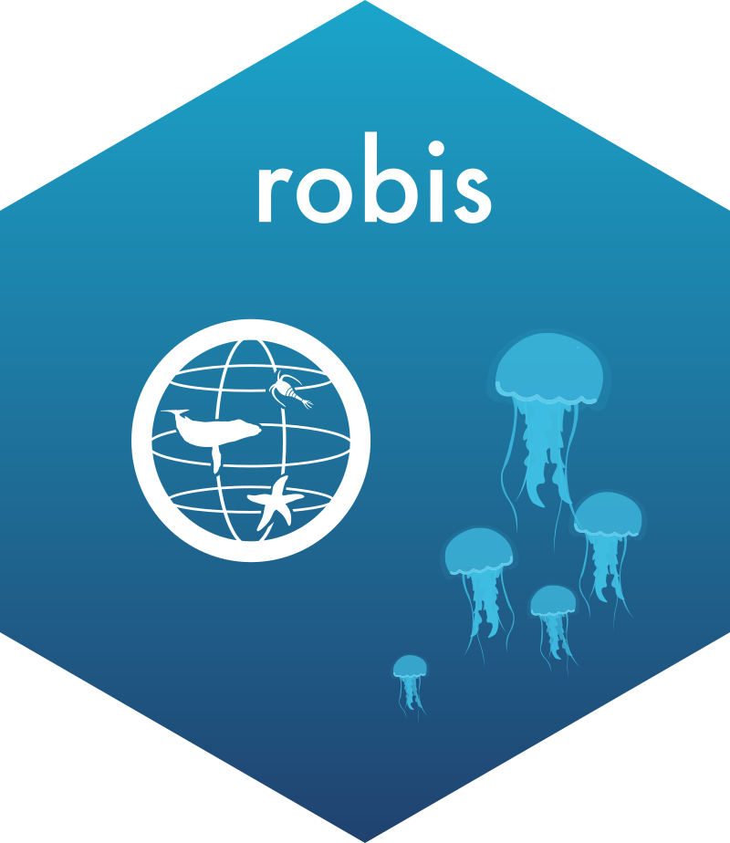

# robis <a href="https://github.com/iobis/robis"></a>

[](https://zenodo.org/badge/latestdoi/47509713)

R client for the OBIS API

## Installation

```R
# CRAN
install.packages("robis")

# latest development version
remotes::install_github("iobis/robis")
```

## Getting started

See the [Getting started vignette](https://iobis.github.io/robis/articles/getting-started.html).
