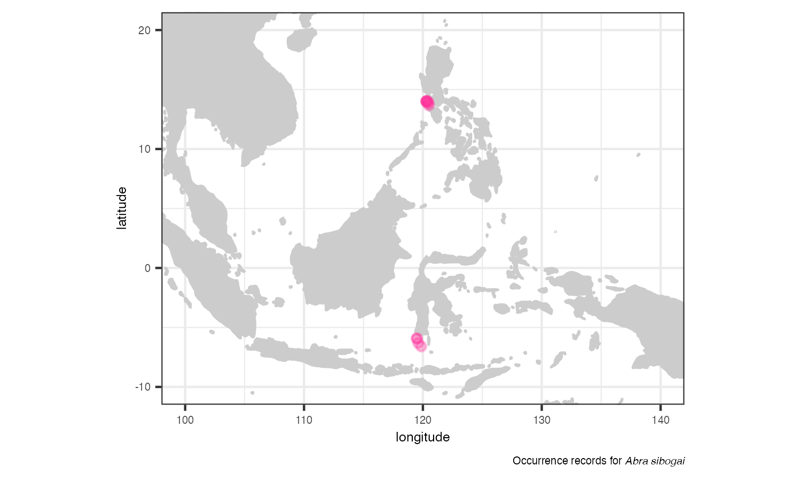

# robis: an R client for the OBIS API <a href="https://github.com/iobis/robis"></a>

[](https://zenodo.org/badge/latestdoi/47509713)

__robis__ is an R package that allows accessing data from the Ocean Biodiversity Information System (OBIS) directly from R. OBIS is a global open-access data and information clearing-house on marine biodiversity for science, conservation and sustainable development.

With __robis__ users can:

- Download data from OBIS
- Create a checklist of taxa that met a set of filters
- Download [measurements and facts](https://manual.obis.org/data_format.html#extendedmeasurementorfact-extension-emof) associated with occurrences
- Create maps from occurrences (including `leaflet` maps)

## Installation

__robis__ is available from CRAN.

```R
# CRAN
install.packages("robis")

# latest development version
remotes::install_github("iobis/robis")
```

## Getting started

The main functions of the __robis__ package are `occurrences` and `checklist`. You can easily download data for one species using:

```R
records <- occurrence(scientificname = "Abra sibogai")
```

Then you can plot the occurrences with:

```R
map_leaflet(records)
```

Or you can create a `ggplot` map using:

```R
map_ggplot(records)
```



With the function `checklist` it's possible to obtain a checklist of all taxa in OBIS that met a certain filter. For example, here we obtain all species from the family "Tellinidae" 

```R
taxa <- checklist(scientificname = "Tellinidae")
```

See the [Getting started vignette](https://iobis.github.io/robis/articles/getting-started.html) for more details on how to download data according to filters and how to extract measurements or facts from occurrence data using the function `measurements`.

#### Spatial Filtering

There are a variety of ways to add a spatial filter to your query:

1. Filter by geography using `areaid` filters.

> OBIS provides polygon filters for about 800 areas of interest, like [the Southern Ocean](https://mapper.obis.org/?areaid=31907) or the [Bay of Bengal](https://mapper.obis.org/?areaid=34273). These can be viewed via the `area()` function and the corresponding `id`s can be used in the `areaid` parameter of the `occurrence()` and `ckecklist)_` functions.

2. Filter with Well-Known Text (WKT) strings.

> Both the `occurrence()` and `checklist()` functions allow spatial filtering with [Well-Known Text (WK)]Thttps://en.wikipedia.org/wiki/Well-known_text_representation_of_geometry strings, via the `geometry` parameter. Following this [example from the OBIS Manual](https://manual.obis.org/access.html#r-package), obtain a checklist of Mollusc species in a certain area:`mollcheck<-checklist(scientificname="Mollusca", geometry = "POLYGON ((2.3 51.8, 2.3 51.6, 2.6 51.6, 2.6 51.8, 2.3 51.8))")`

If you're unsure how to construct WKT, `robis` includes the function `get_geometry`, which provides an interactive tool to draw shapes and return WKT than can be plugged into queries.

To use it, run: `wkt <- get_geometry()`. This will open up the tool in the Viewer of RStudio. You can zoom, pan, and use the shapes to draw on the map. If you are satisfied, click the 'Done' button in the bottom right hand corner, and it will assign the WKT to the object `wkt`. If you aren't happy with what you've drawn, you can click the trashcan icon to clear the shape from the tool.

## How to use OBIS data

OBIS holds a large collection of biodiversity information, with more than 100 million presence records and almost 200 measurements and facts. This information is powering research in areas like taxonomy, phylogeny and ecology, and is being used as an important tool in conservation and management. You can learn more about OBIS with the [OBIS manual](https://manual.obis.org/). You can also explore some of our [use cases](https://obis.org/usecases/) or the many [publications](https://obis.org/library/) that applied OBIS data.

## obistools package

There is a companion package, __obistools__, available from GitHub: [github.com/iobis/obistools](https://github.com/iobis/obistools)

__obistools__ provide several tools for cleaning data downloaded from OBIS, like:

- Checking points on land
- Checking depths
- Checking dates
